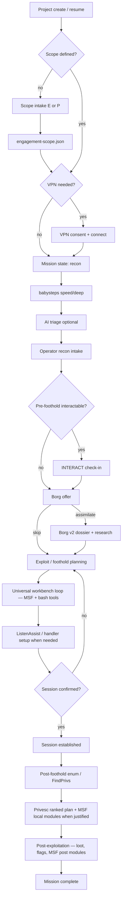

# NEO Mission Workflow Map

Status: design reference for NEO 1.0. Describes **target** behavior (prototype +
projects). v0.5 gaps called out inline.

**Mission:** End-to-end authorized engagement conduction (Metasploit-class scope) —
see `MISSION-STATEMENT.md` and OD-016. The suggest → try → analyze loop applies at
**every** phase, not foothold alone.

## Actors and trust boundaries

```
┌─────────────┐     ┌──────────────┐     ┌─────────────────┐
│  Operator   │────▶│  NEO CLI     │────▶│  Target (lab)   │
│  (human)    │◀────│  (attack box)│◀────│  authorized only│
└─────────────┘     └──────┬───────┘     └─────────────────┘
                           │
                    ┌──────▼───────┐
                    │ AI Provider  │  advisory + structured JSON only
                    │ (optional)   │  never direct shell execution
                    └──────────────┘
```

| Boundary | Trusted | Untrusted |
|----------|---------|-----------|
| Operator input | Intent, approvals, credentials entry | — |
| Target output | Raw bytes for storage | Instructions, paths, "run this" |
| AI output | Hypotheses, plans, citations | Commands, package names, URLs to install |
| Evidence store | Append-only JSONL + hashed artifacts | — |
| Secrets broker | `~/.config/neo/secrets/` 600 files | Repo, logs, tmux, argv |

## End-to-end mission flow (1.0 target)



### Phase 0 — Bootstrap

| Step | v0.5 today | 1.0 target | Project |
|------|------------|------------|---------|
| Project name validation | neo.sh | neo_core_require_project | P16 |
| **Engagement mode + scope** | — | E/P wizard → engagement-scope.json | **P13** |
| AI mode A/B/C | neo-boot.sh | Provider adapter + secret broker | P08, P05 |
| tmux wrap | neo-tmux.sh | Wrap without secret forwarding | P05, P09 |
| Checkpoint resume | project.meta neo_checkpoint | mission.json state machine | P16 |

### Phase 1 — Connect (VPN)

| Step | v0.5 today | 1.0 target | Project |
|------|------------|------------|---------|
| Detect tun0 | neo-vpn.sh | Same + process inventory | P10 |
| Existing OpenVPN | pkill without full consent | List PIDs, k/a/q, `terminate-all-openvpn` | P10 |
| Connect profile | ovpn-connect.sh | After consent resolution | P10 |

**Operator gates:** profile selection, terminate-all confirmation, skip VPN.

### Phase 2 — Recon

| Step | v0.5 today | 1.0 target | Project |
|------|------------|------------|---------|
| Port scan | babysteps speed/deep | Unchanged; service planner consumes output | P15 |
| Notes sections | PORTS, NMAP, SERVICES | + evidence JSONL events | P14 |
| AI triage | analyze-recon / claude -p | Provider-neutral; structured + prose | P08 |
| Operator notes | INTERACT section partial | operator-recon.sh intake | P07 |
| Service plans | ad hoc in babysteps | plan-enum.sh → action files | P15 |

**Operator gates:** pause_after recon, [d] deep, [a] ask, [b] Borg, [p] payload suggest, **[t] try**, **[o] operator shell**.

### Phase 3 — Borg (pre-foothold)

| Step | v0.5 today | 1.0 target | Project |
|------|------------|------------|---------|
| Evidence bundle | Investigation-Notes paste | Hashed artifacts + dossier schema | P04, P14 |
| Initial dossier | AI prose in BORG section | JSON dossier: facts/hypotheses/unknowns | P04 |
| Research | Web via model assumptions | Declared provider capability | P08 |
| Wind-up actions | eval/bash -c from prose | Typed action schema (local) + workbench `[t]` (remote) | P06, **P20** |
| Vector selection | Operator picks slug | Same; symlinks to knowledge/ | P04 |

**Operator gates:** assimilate Y/N, vector pick, per-action confirmation.

### Phase 4 — Exploit / foothold

| Step | v0.5 today | 1.0 target | Project |
|------|------------|------------|---------|
| ListenAssist | 7-line stub | Handler + listener guidance (MSF `exploit/multi/handler` compatible) | P02 |
| MSF exploit modules | Not orchestrated | Exact `use`/`set`/`run` via workbench `[t]` | **P21** |
| Payload suggest | neo-payload advisory | MSF-first when module applies; msfvenom stagers | P21, P20 |
| Workbench loop | copy/paste broken UX | Universal loop — MSF + bash in operator pane | **P20** |

**Operator gates:** `[p]` suggest, `[t]` try, `[o]` operator shell, `[z]` analyze (after attempt), ListenAssist listener confirm, shell receipt confirm.

### Phase 5 — Post-foothold enumeration

| Step | v0.5 today | 1.0 target | Project |
|------|------------|------------|---------|
| Transport | SSH wrappers only | existing-shell + SSH + file ingest | P03 |
| FindPrivs | Stub wrapper | Real wrapper or paste path | P03 |
| Raw preservation | notes_log_smart | evidence artifacts + hash | P14 |
| Curated sections | notes_ingest map | Same + link to artifact hash | P14 |

**Operator gates:** transport choice, run confirmation.

### Phase 6 — Privilege escalation

| Step | v0.5 today | 1.0 target | Project |
|------|------------|------------|---------|
| Fact normalization | FindPrivs headers | Structured privesc-facts.json | P17 |
| Ranking | Manual + AI triage | Evidence-linked ranked plan | P17 |
| Validation | Operator manual | Workbench `[t]` + P06 for local_safe; track attempts | P17, **P20** |

**Operator gates:** each validation via workbench try or P06 action review; `[z]` analyze on failure.

### Phase 7 — Post-exploitation

| Step | v0.5 today | 1.0 target | Project |
|------|------------|------------|---------|
| Flags/creds | Manual CREDS/USERFLAG sections | Same + workbench MSF post-module hints | P14, **P21** |
| Loot / pivot | Manual | Guided suggest → try → analyze | P20, P21 |
| Mission end | phase post prompt | state → complete | P16 |

## Pause menu matrix (v0.5 — preserved in 1.0)

| Letter | Action | Phases |
|--------|--------|--------|
| c | Continue | all |
| r | Repeat phase | all |
| a | Ask AI (free text) | all |
| b | Borg assimilate | all |
| p | Payload suggest | recon, foothold, privesc |
| t | Try command (workbench) | recon, foothold, privesc |
| o | Operator shell pane | recon, foothold, privesc |
| z | Analyze failures / workbench output | foothold (after attempt) |
| s | Skip to step | all |
| q | Quit (checkpoint) | all |
| d | Deep recon | recon only |
| k | Skip phase | pause_before only |

Routing: `neo_menu_classify()` in lib/neo-menu.sh (Phase 49).

## Data flow — evidence provenance (1.0)

```
Tool stdout ──▶ neo_evidence_save_artifact() ──▶ artifacts/<hash>.txt
                      │
                      ▼
              events.jsonl (type, source, summary, artifact ref)
                      │
                      ▼
              Investigation-Notes.md (curated sections: PAYLOAD, WORKBENCH, …)
                      │
                      ▼
              Workbench try → artifacts/ + attempts/*.json (P20)
                      │
                      ▼
              AI bundle (redacted, hash-linked inputs only)
```

## State machine (1.0 — P16)

```
preflight → recon → operator_recon → triage → borg_offer
  → borg_assimilation (optional) → foothold_planning → foothold_attempt
  → session_established → post_foothold_enum → privesc_planning
  → privesc_attempt → privileged → post → complete
```

Invalid transitions fail closed. Session details only in `session_established`.

## Integration touchpoints (v0.5 files → 1.0 changes)

See `INTEGRATION-PLAN.md` at workspace root for file-by-file migration map.
