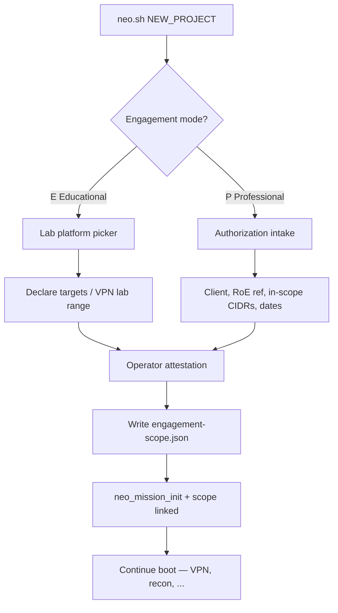

# P13 — Engagement Scope Policy

**Status:** review_ready · **Priority:** P1 · **Depends:** P01, P06, P14, P16

## Operator intent (2026-08-31 revision)

NEO serves **two audiences** with one codebase:

| Mode | Use case | Examples |
|------|----------|----------|
| **Educational** | Learning on intentionally vulnerable infrastructure | HTB, TryHackMe, home lab, course VMs |
| **Professional** | Authorized real-world assessments | Client pentest with signed RoE / SOW |

Scope is **not** a post-1.0 afterthought. Every new project begins with an engagement
mode selection and scope capture before recon runs. Professional mode requires explicit
authorization metadata; educational mode uses a lighter lab-oriented intake with the same
underlying schema.

## Design principles

1. **Ask at project creation** — before `babysteps`, before VPN ritual completes target work
2. **One schema, two profiles** — `engagement-scope.json` with `mode: educational|professional`
3. **Fail safe for professional** — out-of-scope network actions blocked unless expanded
4. **Warn + confirm for educational** — mis-aimed scans allowed only after logged override
5. **Never store signed PDFs in git** — reference path or ticket ID only; file lives outside repo
6. **Scope travels with mission** — `mission.json` holds `engagement_mode` + `scope_file` ref

## Project creation flow



### Prompt (first line)

```
This project will be used for:
  [E] Educational lab (HTB, THM, course box, home lab)
  [P] Professional authorized assessment (real client / production-adjacent)
```

Case-insensitive. Choice is immutable without `neo scope migrate` (audited).

---

## Educational intake (requirements 13b-edu)

Collect:

| Field | Required | Notes |
|-------|----------|-------|
| `platform` | yes | `htb`, `tryhackme`, `home_lab`, `course`, `other` |
| `platform_label` | if other | Free text, e.g. "OffSec PG" |
| `targets` | yes | IP or hostname of lab box; optional CIDR if user declares VPN range |
| `purpose` | yes | One line, e.g. "HTB Popcorn practice" |
| `attestation` | yes | Operator types `authorized-lab` |

**Defaults for known platforms:**

| Platform | Suggested in-scope hint | Exclusions hint |
|----------|---------------------------|-----------------|
| HTB | `10.10.10.0/23`, `10.10.11.0/24`, `10.129.0.0/16` | Operator VPN gateway |
| TryHackMe | `10.10.0.0/16` (tunable) | — |
| home_lab | User-supplied CIDR only | — |

Hints are **pre-filled, editable** — not forced. Operator remains responsible.

**Educational enforcement:** If a network action target is outside declared scope:
- Print warning with declared vs attempted target
- Require typed `scope-override` to proceed
- Log `scope_override` event to evidence JSONL

---

## Professional intake (requirements 13b-pro)

**Option A — Interactive wizard:** `scope-intake.sh` prompts field-by-field.

**Option B — Scope policy document (recommended for real engagements):**

1. Operator copies `templates/scope-policy-template.md` outside the repo
2. Fills RoE sections (in-scope, exclusions, techniques, hours, AI-SCOPE-RULES)
3. Imports via `scope-import.sh --project NAME --policy /path/to/scope-policy.md`
4. NEO parses YAML front matter + consolidated host lists → `engagement-scope.json`
5. AI layers receive redacted scope summary + `AI-SCOPE-RULES` block for safeguards

See `templates/scope-policy-template.md` for the full fillable template.

Collect (wizard or import):

| Field | Required | Notes |
|-------|----------|-------|
| `client_name` | yes | Organization or codename |
| `authorization_reference` | yes | SOW ID, ticket #, or "see engagement letter" |
| `authorization_document` | optional | Path outside repo, e.g. `~/engagements/acme-2026/sow.pdf` |
| `authorized_by` | yes | Name/role of signer |
| `valid_from` / `valid_until` | yes | ISO dates; warn if expired |
| `in_scope.hosts` | yes | IPs, CIDRs |
| `in_scope.domains` | optional | `*.client.com` |
| `in_scope.ports` | optional | Default `1-65535` if omitted |
| `exclusions` | recommended | Client VPN gateways, production DBs, etc. |
| `attestation` | yes | Operator types `authorized-engagement` |

**Professional enforcement:** If target outside scope:
- **Block** action at P06 policy layer
- Offer `[x] Expand scope` → mini-wizard appends to scope file with audit trail
- Imported hosts from redirect/DNS (13e) default **pending** until operator approves

---

## engagement-scope.json schema

See `schemas/engagement-scope.schema.json`.

```json
{
  "schema_version": 1,
  "mode": "educational",
  "created_at": "2026-08-31T17:00:00Z",
  "project": "popcorn",
  "platform": "htb",
  "purpose": "HTB Popcorn practice",
  "attestation": {
    "phrase": "authorized-lab",
    "confirmed_at": "2026-08-31T17:00:05Z"
  },
  "in_scope": {
    "hosts": ["10.10.11.245"],
    "networks": ["10.10.11.0/24"],
    "domains": [],
    "ports": ["1-65535"]
  },
  "exclusions": [],
  "authorization": null
}
```

Professional example adds:

```json
"authorization": {
  "client_name": "Acme Corp",
  "reference": "SOW-2026-0142",
  "document_path": "/home/neo/engagements/acme/sow.pdf",
  "authorized_by": "Jane Doe, CISO",
  "valid_from": "2026-08-01",
  "valid_until": "2026-08-31"
}
```

Stored at: `~/.local/state/neo/projects/<project>/engagement-scope.json` (mode 600).

Also mirrored summary in `project.meta` as `engagement_mode=educational|professional` for
glance tools (`status.sh`).

---

## Enforcement integration (P06)

Extend `neo-action_execute` and `plan-enum.sh` emit path:

```bash
neo_scope_check_network TARGET HOST PORT
# returns: 0 in-scope | 1 warn (educational) | 2 block (professional OOS)
```

Action policy adds:

```json
{
  "scope_check": "network",
  "educational_override_phrase": "scope-override",
  "professional_expansion_required": true
}
```

AI bundles include scope summary so models do not suggest out-of-scope hosts.

---

## Scope expansion (13d)

```bash
neo scope expand --project NAME --add-host 10.20.30.40 --reason "Pivot via compromised DMZ"
```

- Appends to `engagement-scope.json` `expansions[]` with timestamp, reason, operator
- Professional: requires re-typing `authorized-engagement` or client-specific phrase
- Evidence event: `scope_expansion`

---

## Relationship to other projects

| Project | Integration |
|---------|-------------|
| P16 | `mission.json` links `scope_file`; state `preflight` includes scope capture |
| P06 | Network actions call `neo_scope_check` before confirm |
| P14 | All scope events in evidence JSONL |
| P07 | Operator recon tagged; does not auto-expand scope |
| P15 | plan-enum targets validated against scope |
| P18 | E2E includes educational + professional intake paths |
| P19 | GUI renders same scope wizard; no separate rules |

---

## Prototype

| Artifact | Purpose |
|----------|---------|
| `lib/neo-scope.sh` | Intake helpers, check, expand |
| `schemas/engagement-scope.schema.json` | Validation |
| `tools/scope-intake.sh` | Standalone wizard for testing |

---

## v0.5 migration

Existing projects without scope file:
- On resume, prompt once for mode + minimal intake
- Default `engagement_mode=unknown` until completed
- `neo.sh` refuses new network phase scripts until scope captured

---

## Acceptance criteria (revised)

| ID | Criterion |
|----|-----------|
| 13a | Scope file represents hosts, networks, domains, ports, exclusions |
| 13b | Mode + purpose + attestation required at project creation |
| 13c | Network actions checked before execution |
| 13d | Expansion is explicit and audited |
| 13e | Discovered/imported targets default pending until approved |
| 13f | Educational and professional profiles use same schema |
| 13g | Professional mode blocks OOS without expansion |
| 13h | Educational mode warns + requires override phrase |

---

## Priority rationale (OD-009 revised)

Scope intake ships in **1.0** because it shapes every downstream workflow and prevents
accidental misuse as NEO grows from HTB practice to professional engagements. Full
automated enforcement can tighten in integration wave 2, but the **ask-at-create** UX
and scope file are 1.0 deliverables.

## Non-goals (1.0)

- Parsing PDF SOWs automatically
- Legal compliance certification
- Multi-tenant RBAC (P19 / enterprise later)
